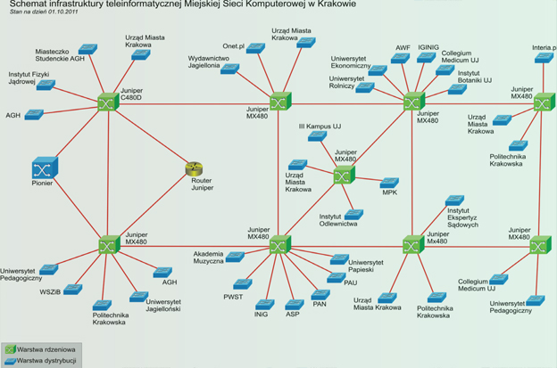

## Struktura adresu IP

```192.168.100.192```
```255.255.255.0```


### Jak policzyć?
#### Adres sieci

1. bierzemy adres ip oraz maske
2.
3.

#### Adres rozgłoszeniowy

1.odwrotność maski sieci
2.bitor z adresu sieci  orad odwrotności maski (w dziesietnym)
3.


## Podział na równą ilość podsieci

```2^S >= n```

Chcemy 7 -> 2^3 >= 7

Maska -> 255.255.255.11100000 -> 255.255.255.224 -> /27


## Wprowadzenie

| dziesiętnie |  binarnie   | 
| ----------- | -----------  |
| ``10``  | 1010| 
| ``92``  | 1011100| 
| ``37``  | 100101| 
| ``240`` | 11110000| 
| ``192`` | 11000000| 
| ``255`` | 11111111| 
| ``128`` | 10000000| 
| ``168`` | 10101000| 

## 

| binarnie |  dziesiętnie   | 
| ----------- | -----------  |
| ``00100000``  | 32 | 
| ``11111000``  | 248| 
| ``10100000``  | 160| 
| ``00110000`` | 48| 
| ``10101100`` | 172| 
| ``01000000`` | 64| 
| ``11111100`` | 252| 
| ``01100010`` | 98| 
 
## Notacja CIDR
##  
| maska |  /(X) x - liczba bitów   | 
| ----------- | -----------  |
| ``255.255.255.0``   | 24| 
| ``255.128.0.0``     |17 | 
| ``255.255.252.0``   |22 | 
| ``255.255.254.0``   |23 | 
| ``255.255.255.240`` | 20| 
| ``255.240.0.0``     | 12| 
## 

| CIDR |  Maska   | 
| ----------- | -----------  |
| ``/8``    |255.000.000.000 | 
| ``/20``   |255.255.240.000 | 
| ``/30``   |255.255.255.252 | 
| ``/16``   |255.255.000.000 | 
| ``/27``   | 255.255.255.224| 
| ``/11``   | 255.224.000.000| 


## Liczba hostów
## 
| sieć |  liczba   | 
| ----------- | -----------  |
| ``10.0.0.0/8``    |24 | 
| ``172.16.0.0/16``   | 16| 
| ``192.168.1.0/24``   | 8| 
| ``192.168.1.0/27``   | 5| 
| ``192.168.1.0/29``   | 3| 
| ``192.168.1.0/31``   | 1| 

* liczba 0 w masce?


## Parametry na podstawie adresu

Mając dany adres hosta i maskę znajdź:
  * adres sieci
  * początkowy adres hosta w sieci
  * liczbę hostów w zadanej podsieci ```2^(32 bity - bity maski maska) - 2 (siec i broadcast)```
  * końcowy zakres adresu hosta w sieci
  * adres rozgłoszeniowy
##   ## 

| Parametr |  wartość   | 
| ----------- | -----------  |
| ``ip``    | 192.168.1.145| 
| ``maska``   | 255.255.255.128 | 
| ``adres sieci``   |192.168.1.128/25 |
| ``liczba hostów``   |126 |
| ``host - min``   |		192.168.1.129 | 
| ``host - max``   |		192.168.1.254 | 
| ``broadcast``   | 192.168.1.255| 
 
## Zadanie

0. Znajdz wszystkie parametry sieci dla hosta o adresie 172.16.128.64 / 16
##   
| Parametr |  wartość   | 
| ----------- | -----------  |
| ``ip``    | 172.16.128.64| 
| ``maska``   | 255.255.0.0 | 
| ``adres sieci``   |	172.16.0.0/16 |
| ``liczba hostów``   |	65534 |
| ``host - min``   |172.16.0.1	 | 
| ``host - max``   |172.16.255.254 | 
| ``broadcast``   | 	172.16.255.255| 

1.
  * Podziel sieć ```192.168.1.0/16``` na 16 równych podsieci
##   
| Adres sieci |  zakres hostów   | Adres Rozgłoszeniowy |
| ----------- | -----------  | ----------- |
| ``192.168.0.0``    | 4094 | 192.168.15.255|
| ``192.168.16.0``   |4094 |192.168.31.255 |
| ``192.168.32.0``   | 4094|192.168.47.255 |
| ``192.168.48.0``   | 4094|192.168.63.255 |
| ``192.168.64.0``   | 4094|192.168.79.255 |
| ``192.168.80.0``   | 4094|192.168.95.255 |

2. 
  * Podziel sieć ``172.16.0.0/16`` na 6 równych podsieci.

3. 
  * Podziel sieć ``192.168.1.0/24``, tak aby każda podsieć miała 11 użytkowników.

4. 
  * Podziel sieć ``10.0.0.0/8`` na 5 podsieci. 
    * Podsieć A ma posiadać 100 000 użytkowników,
    * B – 10 000 użytkowników
    * C – 3 000 użytkowników
    * D – 500 użytkowników
    * E – 2 użytkowników.
    
## Wizualizacja




## Materiały

    * http://www.cyfronet.krakow.pl/sieci/13152,artykul,charakterystyka_sieci.html
    * https://www.computerworld.pl/news/Sieci-szkieletowe-polskich-operatorow,394360.html
    * https://cidr.xyz/

    * Lista polskich puli adresów
    * http://42.pl/pl/networks.html?html=1
