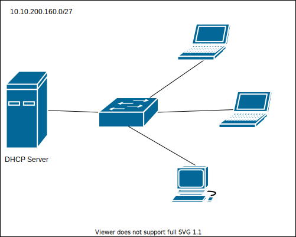

# DHCP - Dynamic Host Configuration Protocol

## Zadanie

1.
   * Przygotuj fizyczną konfigurację sieci zgodnie z powyższym diagramem
   * Skonfiguruj serwer DHCP aby przydzielał pozostałe dostępne adresy w sieci
     * 1 dostępny, adres bramy, 
     * 2 dostępny, adres serewra DHCP
     * pozostałe przydzielane przez DHCP
   * Skonfiguruj klienty do pracy z DHCP
   * Zweryfikuj połączenie pomiedzy maszynami
  
2. 
   * Z wykorzystaniem ``virtualbox`` przygotuj podobną konfigurację gdzie w jednej sieci pracuje komputer pełniący rolę serwera DHCP oraz komputer klienta
   * Skonfiguruj serwer DHCP aby przypisywał konfigurację IP zgodnie z obraną adresacją
   * Zweryfikuj poprawność przypisywanych parametrów na pozostałych komputerach pracujacych w sieci 

## Parametry konfiguracji DHCP
Jaki parametry konfiguracji można ustawić z wykorzystaniem DHCP

| Parametr                    | 
| -------------                 |
| Adres IP                      |
| Maska podsieci                |
| Addres DNS|
| maksymalny czas oczekiwania na odpowiedź w protokole ARP|
| wartość MTU (maksymalny rozmiar pakietu)|
| adres IP serwera SMTP|
|adresy serwerów NIS |

## Przydatne polecenia

| zachowanie                    | polecenia               | komentarz                |
| -------------                 |:-------------:            | -----:                    |
| porzucanie dzierżawy adresu v1|  |     ipconfig /release     |
| porzucanie dzierżawy adresu v2|  |     ipconfig /renew     |

## Materiały

* https://kb.isc.org/docs/isc-dhcp-44-manual-pages-dhcpdconf
